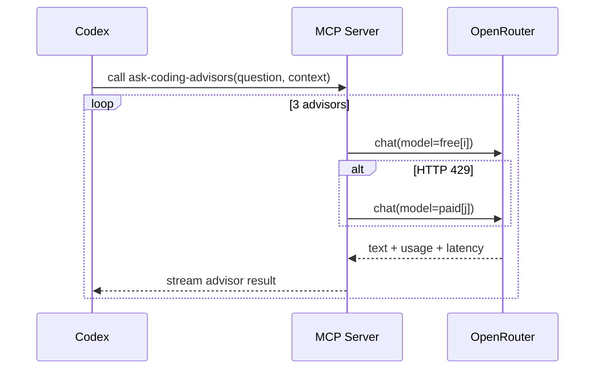

<div align="center">
  
  <h1>🪄 MCP AI Bug Helper</h1>
  <p>Die schnellste Möglichkeit, Codex CLI ein Notfall-Team aus drei Coding-LLMs (plus Premium-Fallback) zur Seite zu stellen.</p>
  <p>
    <a href="https://www.npmjs.com/package/@meinzeug/mcp-ai-bug-helper">
      
    </a>
    <a href="https://www.npmjs.com/package/@meinzeug/mcp-ai-bug-helper">
      
    </a>
    
    
    
  </p>
  <sub>Stand: 18. November 2025 · scoped npm Paket · stdio MCP transport</sub>
</div>

---

## 🔗 Inhaltsverzeichnis

1. [✨ Highlights](#-highlights)
2. [⚡️ Schnellstart](#️-schnellstart)
3. [🛠️ Tool-Flow](#️-tool-flow)
4. [🤝 Codex-Integration](#-codex-integration)
5. [⚙️ Konfiguration](#️-konfiguration)
6. [🏗️ Architektur](#️-architektur)
7. [🧪 Entwicklungs-Workflow](#-entwicklungs-workflow)
8. [🧩 Troubleshooting](#-troubleshooting)
9. [📜 Lizenz](#-lizenz)

---

## ✨ Highlights

- 🧠 **Mehrstufige Advisor-Pipeline:** 3 kostenlose OpenRouter-Codingmodelle + automatische Premium-Fallbacks bei Rate-Limits.
- 🤖 **Codex-native Instruktionen:** MCP Instructions erklären dem Agent genau, wann das Tool sinnvoll ist.
- 📉 **Kosten- & Latenz-Telemetrie:** Jede Antwort liefert Token-Usage + Antwortzeit direkt an Codex zurück.
- ⚡ **`npx`-fähig:** `npx @meinzeug/mcp-ai-bug-helper` reicht – kein Clonen erforderlich.
- 🔐 **Secretsafe:** `.env` + `dotenv` für API Keys, keine versehentlichen Commits.

---

## ⚡️ Schnellstart

### Option A – Zero Install via `npx`

```bash
export OPENROUTER_API_KEY=sk-or-v1-...   # einmalig setzen
npx @meinzeug/mcp-ai-bug-helper
```

### Option B – Lokal entwickeln

```bash
git clone https://github.com/meinzeug/mcp-ai-bug-helper.git
cd mcp-ai-bug-helper
npm install
cp .env.example .env && $EDITOR .env   # Key eintragen
npm run dev
```

> 💡 `npm run dev` startet den MCP-Server via `ts-node` und streamt Logs – perfekt zum Debuggen.

> 📦 Veröffentlichtes Paket: [`@meinzeug/mcp-ai-bug-helper`](https://www.npmjs.com/package/@meinzeug/mcp-ai-bug-helper) – überprüfbar mit `npm view @meinzeug/mcp-ai-bug-helper`.

---

## 🛠️ Tool-Flow

| Phase | Beschreibung |
|-------|--------------|
| 🔍 Analyse | `ask-coding-advisors` nimmt `question` + optional `context` entgegen (Stacktraces, Diffs, Logs). |
| 🧑‍💻 Advisor-Fächer | `qwen/qwen3-coder:free`, `qwen/qwen-2.5-coder-32b-instruct:free`, `agentica-org/deepcoder-14b-preview:free`. |
| 🚨 Fallback-Trigger | Erstes HTTP 429 schaltet auf Premium-Rotation: `anthropic/claude-3.7-sonnet`, `mistralai/codestral-2508`. |
| 📊 Response-Payload | Drei unabhängige Antworten + Latency + Token-Stats + Hinweis, ob Fallback aktiv war. |

### Adaptive Modellwahl

- 🔎 Jeder Prompt wird analysiert (Keywords für React/Go/infra/LLM etc.), daraus entstehen `ScenarioTags` (z. B. `frontend`, `node`, `go`).
- 🤖 Für jeden Tag gibt es passende Modelle mit hinterlegten Stärken und Zuverlässigkeitsskalen (platinum/gold/silver).
- ✅ Vor jedem Call prüft der Server über `GET /api/v1/models`, ob das Modell beim Account verfügbar ist. Modelle mit 404/500 werden für einige Minuten automatisch gesperrt.
- 💳 Wenn kein gesundes Free-Modell verfügbar ist oder ein 429 zurückkommt, wird automatisch auf Premium-Fallbacks (Claude, Codestral, GPT-5.1 Codex) gewechselt.



---

## 🤝 Codex-Integration

1. **Server in Codex registrieren**
   ```bash
   codex mcp add coding-advisors \
     --cmd "npx" \
     --args "@meinzeug/mcp-ai-bug-helper" \
     --env "OPENROUTER_API_KEY=${OPENROUTER_API_KEY}"
   ```
2. **Verifizieren**
   ```bash
   codex mcp list | grep coding-advisors
   ```
3. **Im Prompt nutzen**
   - `/tools` → `ask-coding-advisors`
   - oder direkt mit `@ask-coding-advisors` im Prompt.

> 📎 Wenn du lieber aus dem Repo startest: `--cmd "node" --args "dist/server.js"` verwenden.

---

## ⚙️ Konfiguration

| Variable | Pflicht | Beschreibung |
|----------|---------|--------------|
| `OPENROUTER_API_KEY` | ✅ | Persönlicher OpenRouter Key (liegt in `.env`). |
| `OPENROUTER_APP_NAME` | ⛔ optional | Eigener Analytics-Tag (Default: `MCP AI Bug Helper`). |
| `OPENROUTER_REFERRER` | ⛔ optional | Referrer-URL für OpenRouter-Dashboard. |

`.env.example` liefert ein Template. Für Mehrfach-Workspaces einfach mehrere `.env` Dateien pflegen und vor dem Start `source`n.

---

## 🏗️ Architektur

- **Transport:** `@modelcontextprotocol/sdk` + `StdioServerTransport`
- **Domainlogik:** `CodingAdvisorCoordinator` orchestriert freie + paid Modelle.
- **HTTP-Layer:** `OpenRouterClient` (native `fetch`, Retry auf Rate-Limits, Usage-Mapping).
- **Config:** `config.ts` liest `.env`, `assertConfig()` schützt vor fehlendem Key.
- **Packaging:** Scoped npm Modul, `bin` → `dist/server.js`, `prepare`/`postbuild` erzeugen ausführbares Artefakt.

```
src/
├─ server.ts            # MCP Bootstrap + Tool Definition
├─ codingAdvisors.ts    # Sequencer + Fallback-Rotation
├─ openrouterClient.ts  # REST Wrapper + Error Handling
├─ modelCatalog.ts      # Liste freier & paid Modelle
├─ config.ts            # dotenv + Validation
└─ errors.ts / types.ts # Hilfsklassen & DTOs
```

---

## 🧪 Entwicklungs-Workflow

| Script | Zweck |
|--------|-------|
| `npm run dev` | MCP Server mit `ts-node` (Logs in Echtzeit). |
| `npm run build` | TypeScript Build + `.d.ts` + Sourcemaps + `postbuild chmod`. |
| `npm run typecheck` | Schneller TS-Check ohne Emit. |
| `npm start` | Führt das gebaute CLI (`dist/server.js`). |
| `npm run scenarios` | Führt reale OpenRouter-Tests auf mehreren Debug-Szenarien aus (filterbar via `SCENARIO=react`). |

> Bei Veröffentlichung sorgt `npm publish` automatisch für frische Builds (via `prepare`).

---

## 🧩 Troubleshooting

- **`Missing OPENROUTER_API_KEY`** – `.env` nicht geladen? Terminal neu starten oder `source .env`.
- **`429 Too Many Requests`** – Die App schwenkt automatisch auf die Premiumliste. Wenn alles blockiert ist, hilft nur Warten oder eigener OpenRouter-Plan.
- **`codex mcp add ...` schlägt fehl** – Prüfe, ob `codex` Zugriff auf `npx` hat (Pfad) oder wechsle auf direkten `node dist/server.js` Befehl.
- **Keine Antworten im Codex-UI** – `npm run dev` separat starten und schauen, ob Requests ankommen (stdout).

---

## 📜 Lizenz

MIT © meinzeug – Mit Liebe für MCP + Codex gebaut. Contributions willkommen! 🎉
